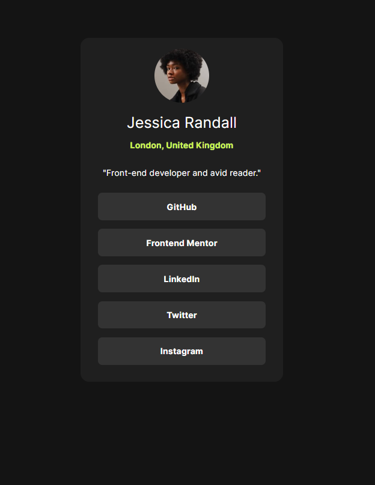

# Frontend Mentor - Social links profile solution

This is a solution to the [Social links profile challenge on Frontend Mentor](https://www.frontendmentor.io/challenges/social-links-profile-UG32l9m6dQ). Frontend Mentor challenges help you improve your coding skills by building realistic projects. 

## Table of contents

- [Overview](#overview)
  - [The challenge](#the-challenge)
  - [Screenshot](#screenshot)
  - [Links](#links)
- [My process](#my-process)
  - [Built with](#built-with)
  - [What I learned](#what-i-learned)
- [Author](#author)

## Overview

### The challenge

Users should be able to:

- See hover and focus states for all interactive elements on the page

### Screenshot

### Links

- Solution URL: [Social Links Solution](https://github.com/ioangheraszim/social-links)
- Live Site URL: [Social Links Live](https://ioangheraszim.github.io/social-links)

## My process

### Built with

- Semantic HTML5 markup
- Tailwind
- Mobile-first workflow

### What I learned

Nothing much just did it for fun.

## Author

- Website - [mreone.dev](https://ioangheraszim.github.io/portofolio/)
- Frontend Mentor - [@ioangheraszim](https://www.frontendmentor.io/profile/ioangheraszim)

